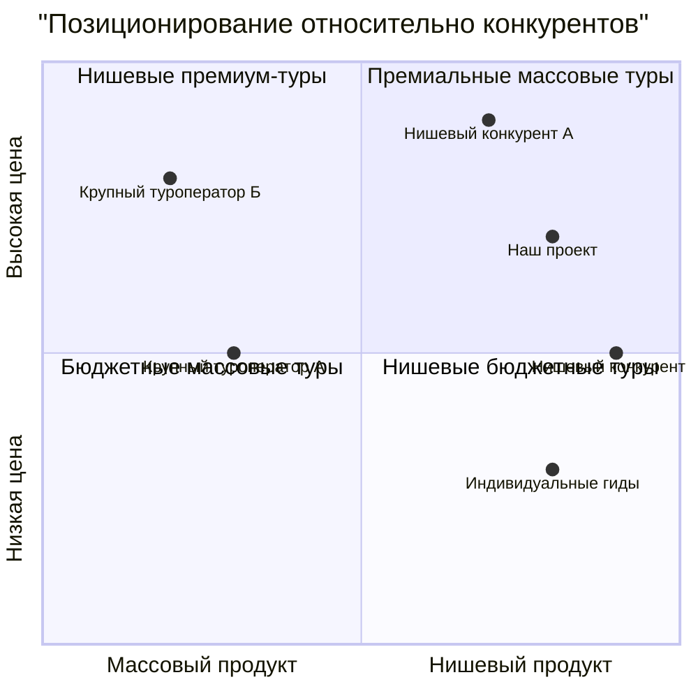

## Приложения

### Приложение 1: Детализация маршрутов

**Основной маршрут (7 дней / 6 ночей)**

|День|Локация|Ключевые активности|
|---|---|---|
|День 1|Диярбакыр|Прибытие, размещение в отеле. Приветственный ужин в старом городе. Знакомство с группой.|
|День 2|Диярбакыр|Исследование старого города, посещение городских стен (UNESCO), Великой мечети, исторических хаммамов. Дегустация местной кухни.|
|День 3|Мардин|Переезд в Мардин. Экскурсия по старому городу с видом на Месопотамскую равнину. Посещение монастыря Дейрульзафаран. Мастер-класс по каллиграфии.|
|День 4|Мардин|Посещение древнего города Дара, экскурсия в Мидьят (центр серебряных дел мастеров). Ужин в традиционном доме с местной семьей.|
|День 5|Газиантеп|Переезд в Газиантеп. Посещение крепости, знакомство с городом. Гастрономический тур по лучшим заведениям города – столицы турецкой кухни.|
|День 6|Газиантеп|Посещение музея мозаики Зевгмы, традиционного базара. Мастер-класс по приготовлению баклавы. Свободное время для шопинга.|
|День 7|Кахраманмараш|Короткий визит в Кахраманмараш, известный своим особым мороженым. Трансфер в аэропорт. Завершение программы.|

**Расширенный маршрут (10 дней / 9 ночей)**

|День|Локация|Ключевые активности|
|---|---|---|
|День 1|Каппадокия|Прибытие, размещение в пещерном отеле. Приветственный ужин.|
|День 2|Каппадокия|Рассвет с возможностью полета на воздушном шаре (опционально). Экскурсия по долинам и пещерным городам.|
|День 3|Каппадокия|Посещение подземного города, музея под открытым небом Гёреме. Переезд в сторону Диярбакыра.|
|Дни 4-10||Программа основного маршрута|

### Приложение 2: Примерная калькуляция стоимости тура

**Расчет на группу 10-12 человек (основной 7-дневный маршрут)**

|Категория расходов|На группу (USD)|На человека (USD)|
|---|---|---|
|**Проживание**|||
|Диярбакыр (2 ночи, 5-6 номеров)|$1,000|$91|
|Мардин (2 ночи, 5-6 номеров)|$1,000|$91|
|Газиантеп (2 ночи, 5-6 номеров)|$1,000|$91|
|**Транспорт**|||
|Аренда микроавтобуса с водителем (7 дней)|$1,400|$127|
|Топливо и дорожные расходы|$300|$27|
|**Питание**|||
|Завтраки (включены в отель)|$0|$0|
|Приветственный и прощальный ужины|$550|$50|
|Дополнительные обеды/ужины (3)|$660|$60|
|**Активности**|||
|Входные билеты в достопримечательности|$330|$30|
|Мастер-классы и специальные мероприятия|$550|$50|
|**Персонал**|||
|Гонорар русскоговорящего гида|$1,000|$91|
|Локальные гиды и специалисты|$400|$36|
|**Прочее**|||
|Материалы и сувениры для участников|$220|$20|
|Непредвиденные расходы (10%)|$841|$76|
|**Итого себестоимость**|**$9,251**|**$841**|
|Маржа (36%)|$3,509|$319|
|**Итоговая стоимость тура**|**$12,760**|**$1,160**|

**Примечания к калькуляции:**

1. **Размер группы и экономика:**
    
    - Расчет выполнен исходя из средней численности группы 11 человек (диапазон 10-12)
    - Оптимальный размер группы 10-12 человек позволяет обеспечить комфортное размещение в 5-6 двухместных номерах
    - При меньшей численности (8-9 человек) стоимость на одного участника увеличивается примерно на 12-15%
    - При полной загрузке (12 человек) маржинальность возрастает до 38-40%
2. **Проживание:**
    
    - Стоимость двухместного номера в бутик-отелях категории 3-4* составляет $80-100 за ночь
    - Для групп 10-12 человек требуется 5-6 номеров в зависимости от состава участников
    - Основатель/гид размещается в отдельном номере (стоимость включена в калькуляцию)
    - В высокий сезон стоимость размещения может увеличиваться на 15-20%
3. **Транспорт:**
    
    - Для групп 10-12 человек оптимальным является микроавтобус на 16-18 мест, обеспечивающий комфорт и достаточное пространство для багажа
    - Средняя стоимость аренды с водителем - $200 в день
    - Дополнительные расходы включают парковки, платные дороги, чаевые водителю
    - Топливные затраты рассчитаны исходя из средней протяженности маршрута 1,200-1,500 км
4. **Питание:**
    
    - Завтраки включены в стоимость проживания в отелях
    - Приветственный и прощальный ужины организуются в ресторанах высокого уровня ($50 на человека)
    - Дополнительно включены в программу 3 групповых обеда/ужина ($20 на человека)
    - Остальное питание оплачивается участниками самостоятельно
5. **Активности:**
    
    - Стоимость входных билетов варьируется от $2 до $15 на человека в зависимости от посещаемого объекта
    - Мастер-классы и специальные мероприятия включают кулинарные воркшопы, демонстрации ремесел, встречи с местными жителями
    - Эксклюзивные мероприятия составляют важную часть ценностного предложения и повышают привлекательность тура
6. **Персонал:**
    
    - Гонорар ведущего гида составляет $1,000 за 7-дневный тур (включая подготовительные и заключительные работы)
    - Дополнительно привлекаются местные специалисты и гиды для отдельных локаций
    - Все расходы на проживание и питание персонала включены в соответствующие категории
7. **Ценообразование и скидки:**
    
    - Базовая стоимость тура составляет $1,160 на человека при двухместном размещении
    - Доплата за одноместное размещение - $250
    - Система скидок включает:
        - Раннее бронирование (за 3+ месяца): 10% ($116)
        - Групповое бронирование (4+ человека): 5% ($58)
        - Постоянные клиенты: 7% ($81)
    - Скидки не суммируются, применяется максимальная
8. **Сезонные корректировки:**
    
    - Высокий сезон (апрель-май, сентябрь-октябрь): базовая цена
    - Средний сезон (март, июнь, август): скидка 5-7%
    - Низкий сезон (ноябрь, февраль): скидка 10-15%
    - В декабре-январе туры проводятся только по запросу для групп от 8 человек
9. **Дополнительные опции:**
    
    - Фотосессия в национальных костюмах: $50
    - Расширенная гастрономическая программа: $120
    - VIP-трансфер (индивидуальный) из/в аэропорт: $60
    - Дополнительная ночь до/после тура: $85
    - Расширенная страховка (включая отмену): $45
10. **Финансовые условия:**
    
    - Депозит при бронировании: 20% ($232)
    - Полная оплата: за 30 дней до начала тура
    - Возврат при отмене за 45+ дней: 100% депозита
    - Возврат при отмене за 30-44 дня: 50% депозита
    - Возврат при отмене менее чем за 30 дней: не предусмотрен (за исключением форс-мажора)

**Сравнительный анализ цен:**

|Вид тура|Наш продукт|Прямые конкуренты|Массовые туры|
|---|---|---|---|
|Стандартный культурный тур (7 дней)|$1,160|$1,300-1,500|$700-850|
|Премиум-тур (7 дней)|$1,400|$1,700-2,000|$1,000-1,200|
|Расширенный тур (10 дней)|$1,650|$1,900-2,300|$1,100-1,350|

Позиционирование по цене в среднем сегменте с премиальными элементами позволяет обеспечить хорошее соотношение цена/качество и привлекать целевую аудиторию, ценящую аутентичный опыт, но не относящуюся к люкс-сегменту.
### Приложение 3: Примеры маркетинговых материалов

**Основные месседжи для маркетинговых коммуникаций:**

1. **Заголовки для рекламы:**
    
    - "Юго-восточная Турция: путешествие вглубь истории и культуры"
    - "Забытые сокровища Месопотамии: авторский тур по юго-востоку Турции"
    - "Гастрономическое путешествие в настоящую столицу турецкой кухни"
    - "Откройте другую Турцию: от античных руин до кулинарных шедевров"
2. **Ключевые сообщения для целевой аудитории:**
    
    - _Для опытных путешественников:_ "Исследуйте регион, где переплетаются древние цивилизации Месопотамии, Анатолии и Леванта"
    - _Для гастротуристов:_ "Погрузитесь в истинные гастрономические традиции родины пахлавы, кебабов и сотен специй"
    - _Для ценителей истории:_ "Пройдите по следам древних цивилизаций с профессиональным историком"
3. **Визуальные образы для использования:**
    
    - Панорамные виды Мардина с террасными домами
    - Крупные планы местных блюд и процесса их приготовления
    - Портреты местных ремесленников за работой
    - Архитектурные детали исторических зданий
    - Аутентичные сцены повседневной жизни

### Приложение 4: Список потенциальных партнеров

**Размещение:**

- Büyük Kervansaray Hotel (Диярбакыр)
- Reyhani Kasrı Hotel (Мардин)
- Аsilzade Konağı (Газиантеп)

**Рестораны и гастрономические партнеры:**

- Kebapçı Halit (Газиантеп)
- Zincirli Bedesten (базар специй, Газиантеп)
- Ciğerci Apo (Мардин)
- İmam Çağdaş (исторический ресторан, Газиантеп)

**Местные гиды и эксперты:**

- Ахмет Йылмаз (археолог, Диярбакыр)
- Мерьем Акин (специалист по гастрономии, Газиантеп)
- Мустафа Эрдоган (историк архитектуры, Мардин)

**Ремесленники и мастера:**

- Семья Демиркая (серебряных дел мастера, Мидьят)
- Ателье Кадироглу (традиционная вышивка, Газиантеп)
- Мастерская Кёксал (изготовление традиционных музыкальных инструментов, Мардин)

**Маркетинговые партнеры:**

- Журнал "Вокруг света"
- Телеграм-канал "Неизвестная Турция"
- Сообщество "Гастрономические путешествия"
- Культурный центр "Турецкий дом" в Москве

### Приложение 5: Сравнительный анализ конкурентов

Данный квадрант показывает, что наш проект позиционируется в сегменте нишевых туров с ценой выше среднего, но не в самом высоком ценовом сегменте. Это позволяет нам конкурировать как с премиальными нишевыми игроками (за счет более доступной цены), так и с массовыми туроператорами (за счет глубины и уникальности опыта).

## Итоговые выводы

Проведенный анализ показывает, что запуск компании по организации авторских туров по юго-восточной Турции имеет значительный потенциал при правильном позиционировании и реализации. Ключевые выводы:

1. **Рыночная ниша** имеет достаточный объем и тенденцию к росту, особенно среди опытных путешественников, ищущих новые, аутентичные направления.
    
2. **Бизнес-модель** может быть прибыльной при условии эффективного контроля расходов и достижения целевой заполняемости групп.
    
3. **Точка безубыточности** (11 клиентов в месяц) достижима даже на раннем этапе, что снижает финансовые риски.
    
4. **Стратегия поэтапного развития** с фокусом на качество и формирование лояльного сообщества обеспечит устойчивый рост.
    
5. **Диверсификация предложения** в долгосрочной перспективе позволит снизить риски сезонности и зависимости от одного направления.
    

Данный бизнес-план представляет собой дорожную карту для запуска и развития проекта, однако требует регулярного пересмотра и адаптации в соответствии с изменяющимися рыночными условиями и обратной связью от клиентов.