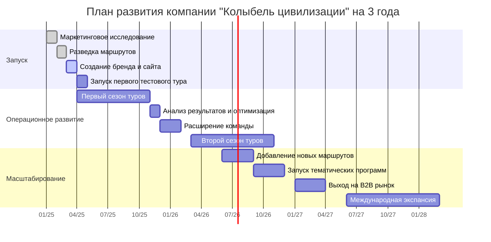
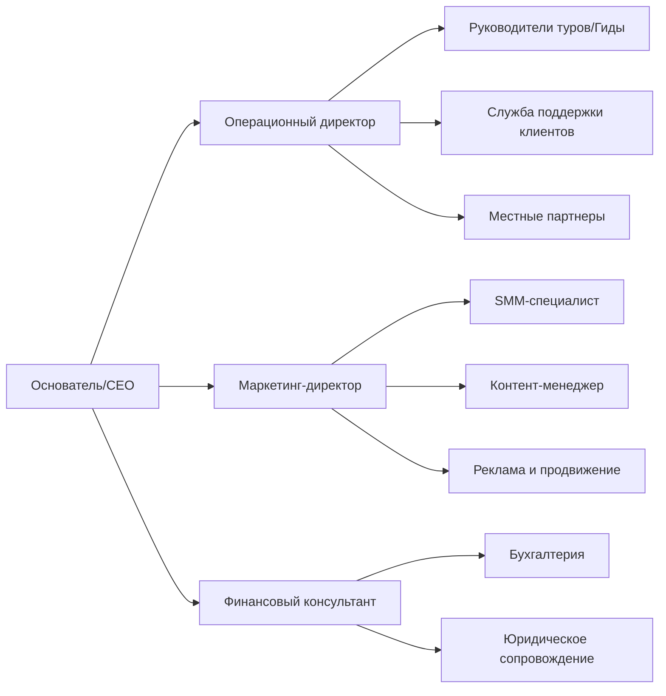
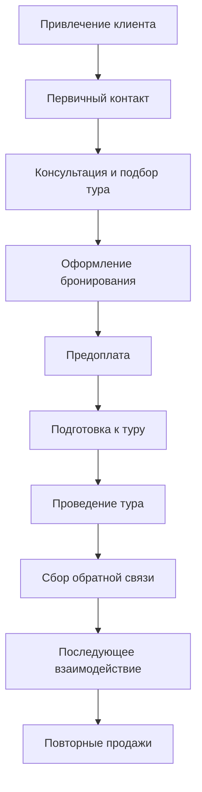

### Диаграмма ключевых этапов развития проекта

### Детальный план на первый год (поквартально)

**Q1 (Январь-Март 2025):**

- Проведение исследования рынка и целевой аудитории
- Разведывательная поездка по маршруту для проработки деталей
- Формирование концепции бренда и визуальной идентичности
- Разработка и запуск сайта компании
- Регистрация юридического лица и оформление необходимых документов
- Начало формирования присутствия в социальных сетях

**Q2 (Апрель-Июнь 2025):**

- Проведение тестового тура для партнеров и блогеров
- Запуск первых коммерческих туров (апрель-май)
- Активный набор первых групп через таргетированную рекламу
- Налаживание партнерских отношений с местными поставщиками услуг
- Сбор и анализ первых отзывов, корректировка программы
- Создание базы контента для маркетинга (фото, видео, отзывы)

**Q3 (Июль-Сентябрь 2025):**

- Проведение высокого сезона туров (сентябрь)
- Расширение маркетинговой активности, привлечение инфлюенсеров
- Тестирование новых элементов программы
- Разработка программы лояльности для повторных клиентов
- Планирование осенних туров с учетом накопленного опыта
- Начало работы над дополнительными форматами туров

**Q4 (Октябрь-Декабрь 2025):**

- Завершение первого туристического сезона (октябрь-ноябрь)
- Комплексный анализ результатов первого года работы
- Оптимизация операционных процессов
- Планирование графика туров на следующий год
- Запуск маркетинговой кампании для раннего бронирования
- Формирование стратегии развития на второй год

### Организационная структура компании

**Примечание к диаграмме:** На начальном этапе многие функции будут совмещаться небольшим количеством сотрудников, с постепенным разделением ролей по мере роста компании.

### Структура процесса продаж

**Ключевые метрики на каждом этапе:**

- Конверсия из лидов в бронирования
- Процент подтвержденных предоплатой бронирований
- Удовлетворенность клиентов (по 5-балльной шкале)
- Процент повторных бронирований
- NPS (индекс потребительской лояльности)
