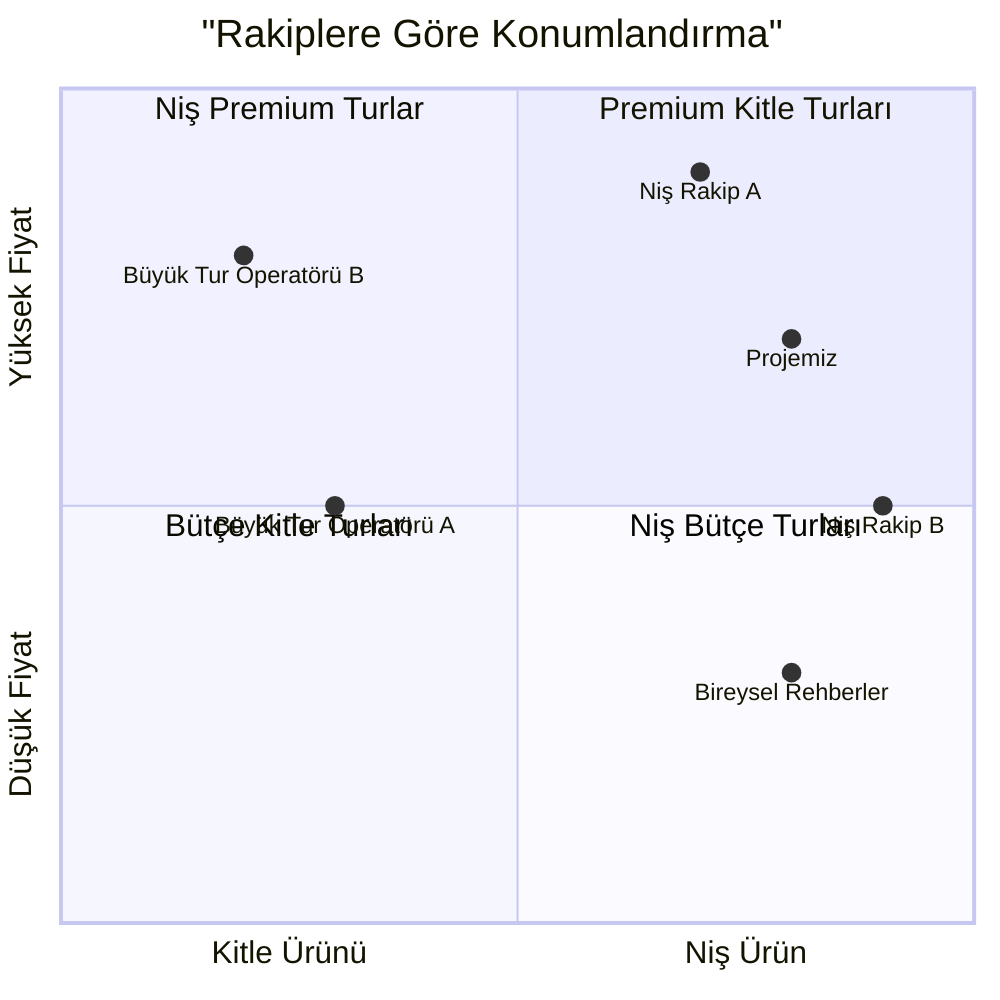

### Ek 1: Rotaların Detaylandırılması

**Ana Rota (7 gün / 6 gece)**

|Gün|Konum|Temel Aktiviteler|
|---|---|---|
|Gün 1|Diyarbakır|Varış, otele yerleşme. Eski şehirde karşılama yemeği. Grupla tanışma.|
|Gün 2|Diyarbakır|Eski şehir keşfi, şehir surlarını (UNESCO) ziyaret, Ulu Cami, tarihi hamamlar. Yerel mutfak tadımı.|
|Gün 3|Mardin|Mardin'e seyahat. Mezopotamya ovasına bakan eski şehir turu. Deyrulzafaran Manastırı ziyareti. Kaligrafi atölyesi.|
|Gün 4|Mardin|Antik Dara şehri ziyareti, Midyat'a gezi (gümüş ustaları merkezi). Yerel bir aileyle geleneksel evde akşam yemeği.|
|Gün 5|Gaziantep|Gaziantep'e seyahat. Kale ziyareti, şehirle tanışma. Türk mutfağının başkenti olan şehrin en iyi mekanlarında gastronomi turu.|
|Gün 6|Gaziantep|Zeugma Mozaik Müzesi, geleneksel çarşı ziyareti. Baklava yapım atölyesi. Alışveriş için serbest zaman.|
|Gün 7|Kahramanmaraş|Özel dondurmasıyla ünlü Kahramanmaraş'a kısa ziyaret. Havalimanına transfer. Program sonu.|

**Genişletilmiş Rota (10 gün / 9 gece)**

|Gün|Konum|Temel Aktiviteler|
|---|---|---|
|Gün 1|Kapadokya|Varış, mağara otele yerleşme. Karşılama yemeği.|
|Gün 2|Kapadokya|Gün doğumunda sıcak hava balonu turu (opsiyonel). Vadiler ve mağara şehirleri turu.|
|Gün 3|Kapadokya|Yeraltı şehri, Göreme açık hava müzesi ziyareti. Diyarbakır yönüne doğru yolculuk.|
|Günler 4-10||Ana rotanın programı|

### Ek 2: Tahmini Tur Maliyet Hesaplaması

**10-12 kişilik grup için hesaplama (ana 7 günlük rota)**

|Gider Kategorisi|Grup Başına (USD)|Kişi Başına (USD)|
|---|---|---|
|**Konaklama**|||
|Diyarbakır (2 gece, 5-6 oda)|$1,000|$91|
|Mardin (2 gece, 5-6 oda)|$1,000|$91|
|Gaziantep (2 gece, 5-6 oda)|$1,000|$91|
|**Ulaşım**|||
|Şoförlü minibüs kiralama (7 gün)|$1,400|$127|
|Yakıt ve yol masrafları|$300|$27|
|**Yemek**|||
|Kahvaltılar (otele dahil)|$0|$0|
|Karşılama ve veda yemekleri|$550|$50|
|Ek öğle/akşam yemekleri (3)|$660|$60|
|**Aktiviteler**|||
|Turistik yerlere giriş ücretleri|$330|$30|
|Atölye çalışmaları ve özel etkinlikler|$550|$50|
|**Personel**|||
|Rusça konuşan rehber ücreti|$1,000|$91|
|Yerel rehberler ve uzmanlar|$400|$36|
|**Diğer**|||
|Katılımcılar için materyaller ve hediyelik eşyalar|$220|$20|
|Beklenmeyen harcamalar (%10)|$841|$76|
|**Toplam maliyet**|**$9,251**|**$841**|
|Kâr marjı (%36)|$3,509|$319|
|**Turun nihai fiyatı**|**$12,760**|**$1,160**|

**Hesaplamaya İlişkin Notlar:**

1. **Grup büyüklüğü ve ekonomisi:**
    
    - Hesaplama, ortalama 11 kişilik grup büyüklüğüne göre yapılmıştır (10-12 kişi aralığı)
    - 10-12 kişilik optimum grup büyüklüğü, 5-6 çift kişilik odada rahat konaklama sağlar
    - Daha küçük grup sayısında (8-9 kişi), katılımcı başına maliyet yaklaşık %12-15 artar
    - Tam dolulukta (12 kişi), kâr marjı %38-40'a yükselir
2. **Konaklama:**
    
    - 3-4* kategorisindeki butik otellerde çift kişilik oda maliyeti gece başına $80-100'dır
    - 10-12 kişilik gruplar için, katılımcıların yapısına bağlı olarak 5-6 oda gereklidir
    - Kurucu/rehber ayrı bir odada kalır (maliyeti hesaplamaya dahildir)
    - Yüksek sezonda konaklama maliyeti %15-20 artabilir
3. **Ulaşım:**
    
    - 10-12 kişilik gruplar için, konfor ve yeterli bagaj alanı sağlayan 16-18 kişilik minibüs idealdir
    - Şoförlü kiralama ortalama maliyeti günde $200'dır
    - Ek masraflar park yerleri, ücretli yollar, şoför bahşişlerini içerir
    - Yakıt maliyetleri, ortalama 1,200-1,500 km'lik rota uzunluğuna göre hesaplanmıştır
4. **Yemek:**
    
    - Kahvaltılar otel konaklama ücretine dahildir
    - Karşılama ve veda yemekleri yüksek kaliteli restoranlarda düzenlenir (kişi başı $50)
    - Programa ek olarak 3 grup öğle/akşam yemeği dahildir (kişi başı $20)
    - Diğer yemekler katılımcılar tarafından ayrıca ödenir
5. **Aktiviteler:**
    
    - Giriş ücretleri, ziyaret edilen yere bağlı olarak kişi başı $2 ila $15 arasında değişir
    - Atölye çalışmaları ve özel etkinlikler mutfak atölyeleri, zanaat gösterileri, yerel halkla buluşmaları içerir
    - Özel etkinlikler, değer teklifinin önemli bir parçasıdır ve turun çekiciliğini artırır
6. **Personel:**
    
    - Baş rehberin ücreti 7 günlük tur için $1,000'dır (hazırlık ve sonuç çalışmaları dahil)
    - Belirli yerler için ek olarak yerel uzmanlar ve rehberler görevlendirilir
    - Tüm personel konaklama ve yemek masrafları ilgili kategorilere dahildir
7. **Fiyatlandırma ve indirimler:**
    
    - Turun temel fiyatı çift kişilik konaklamada kişi başı $1,160'dır
    - Tek kişilik oda için ek ücret - $250
    - İndirim sistemi şunları içerir:
        - Erken rezervasyon (3+ ay öncesinden): %10 ($116)
        - Grup rezervasyonu (4+ kişi): %5 ($58)
        - Sürekli müşteriler: %7 ($81)
    - İndirimler toplanmaz, maksimum indirim uygulanır
8. **Mevsimsel düzeltmeler:**
    
    - Yüksek sezon (Nisan-Mayıs, Eylül-Ekim): temel fiyat
    - Orta sezon (Mart, Haziran, Ağustos): %5-7 indirim
    - Düşük sezon (Kasım, Şubat): %10-15 indirim
    - Aralık-Ocak aylarında turlar yalnızca 8 kişiden fazla gruplar için talep üzerine düzenlenir
9. **Ek seçenekler:**
    
    - Geleneksel kıyafetlerle fotoğraf çekimi: $50
    - Genişletilmiş gastronomi programı: $120
    - VIP transfer (bireysel) havalimanından/havalimanına: $60
    - Tur öncesi/sonrası ek gece: $85
    - Genişletilmiş sigorta (iptal dahil): $45
10. **Finansal koşullar:**
    
    - Rezervasyon sırasında depozito: %20 ($232)
    - Tam ödeme: tur başlangıcından 30 gün önce
    - 45+ gün öncesinde iptal durumunda iade: %100 depozito
    - 30-44 gün öncesinde iptal durumunda iade: %50 depozito
    - 30 günden az bir süre kala iptal durumunda iade: öngörülmemiştir (mücbir sebepler hariç)

**Karşılaştırmalı Fiyat Analizi:**

|Tur Türü|Bizim Ürünümüz|Doğrudan Rakipler|Kitle Turları|
|---|---|---|---|
|Standart kültür turu (7 gün)|$1,160|$1,300-1,500|$700-850|
|Premium tur (7 gün)|$1,400|$1,700-2,000|$1,000-1,200|
|Genişletilmiş tur (10 gün)|$1,650|$1,900-2,300|$1,100-1,350|

Premium unsurlarla orta segmentte fiyat konumlandırması, iyi bir fiyat/kalite oranı sağlar ve otantik deneyimi değerleyen ancak lüks segmente ait olmayan hedef kitleyi çeker.

### Ek 3: Pazarlama Materyalleri Örnekleri

**Pazarlama İletişimleri için Temel Mesajlar:**

1. **Reklam Başlıkları:**
    
    - "Güneydoğu Türkiye: Tarih ve Kültürün Derinliklerine Yolculuk"
    - "Mezopotamya'nın Unutulmuş Hazineleri: Türkiye'nin Güneydoğusunda Özel Tur"
    - "Türk Mutfağının Gerçek Başkentine Gastronomik Yolculuk"
    - "Farklı Bir Türkiye Keşfedin: Antik Kalıntılardan Mutfak Şaheserlerine"
2. **Hedef Kitle için Anahtar Mesajlar:**
    
    - _Deneyimli gezginler için:_ "Mezopotamya, Anadolu ve Levant'ın antik uygarlıklarının iç içe geçtiği bölgeyi keşfedin"
    - _Gastro turistler için:_ "Baklava, kebap ve yüzlerce baharatın anavatanının gerçek gastronomik geleneklerine dalın"
    - _Tarih meraklıları için:_ "Profesyonel bir tarihçi eşliğinde antik uygarlıkların izini sürün"
3. **Kullanılacak Görsel İmgeler:**
    
    - Teraslı evleriyle Mardin'in panoramik görünümleri
    - Yerel yemeklerin ve hazırlanma süreçlerinin yakın plan görüntüleri
    - Çalışırken yerel zanaatkarların portreleri
    - Tarihi binaların mimari detayları
    - Günlük yaşamın otantik sahneleri

### Ek 4: Potansiyel Ortaklar Listesi

**Konaklama:**

- Büyük Kervansaray Hotel (Diyarbakır)
- Reyhani Kasrı Hotel (Mardin)
- Аsilzade Konağı (Gaziantep)

**Restoranlar ve Gastronomi Ortakları:**

- Kebapçı Halit (Gaziantep)
- Zincirli Bedesten (baharat çarşısı, Gaziantep)
- Ciğerci Apo (Mardin)
- İmam Çağdaş (tarihi restoran, Gaziantep)

**Yerel Rehberler ve Uzmanlar:**

- Ahmet Yılmaz (arkeolog, Diyarbakır)
- Meryem Akın (gastronomi uzmanı, Gaziantep)
- Mustafa Erdoğan (mimari tarihçisi, Mardin)

**Zanaatkarlar ve Ustalar:**

- Demirkaya Ailesi (gümüş ustaları, Midyat)
- Kadiroğlu Atölyesi (geleneksel nakış, Gaziantep)
- Köksal Atölyesi (geleneksel müzik aletleri yapımı, Mardin)

**Pazarlama Ortakları:**

- "Vokrug Sveta" (Dünya Çevresinde) Dergisi
- "Bilinmeyen Türkiye" Telegram Kanalı
- "Gastronomik Seyahatler" Topluluğu
- Moskova'daki "Türk Evi" Kültür Merkezi

### Ek 5: Rakip Analizi Karşılaştırması

Bu kadran, projemizin ortalamanın üzerinde bir fiyatla niş turlar segmentinde, ancak en yüksek fiyat segmentinde olmadığını göstermektedir. Bu, hem premium niş oyuncularla (daha uygun fiyat sayesinde), hem de kitle tur operatörleriyle (deneyimin derinliği ve benzersizliği sayesinde) rekabet edebilmemizi sağlar.

## Nihai Sonuçlar

Yapılan analiz, güneydoğu Türkiye'ye özel turlar düzenleyen bir şirketin doğru konumlandırma ve uygulama ile önemli bir potansiyele sahip olduğunu göstermektedir. Temel sonuçlar:

1. **Pazar nişi**, özellikle yeni, otantik destinasyonlar arayan deneyimli gezginler arasında yeterli hacme ve büyüme eğilimine sahiptir.
    
2. **İş modeli**, etkili maliyet kontrolü ve hedef grup doluluk oranına ulaşıldığında kârlı olabilir.
    
3. **Başabaş noktası** (ayda 11 müşteri) erken aşamada bile ulaşılabilirdir, bu da finansal riskleri azaltır.
    
4. **Kaliteye ve sadık bir topluluk oluşturmaya odaklanan aşamalı gelişim stratejisi** sürdürülebilir büyüme sağlayacaktır.
    
5. **Uzun vadede teklif çeşitlendirme**, mevsimsellik ve tek bir destinasyona bağımlılık risklerini azaltacaktır.
    

Bu iş planı, projenin başlatılması ve geliştirilmesi için bir yol haritası sunmaktadır, ancak değişen pazar koşullarına ve müşteri geri bildirimlerine göre düzenli olarak gözden geçirilmesi ve uyarlanması gerekmektedir.