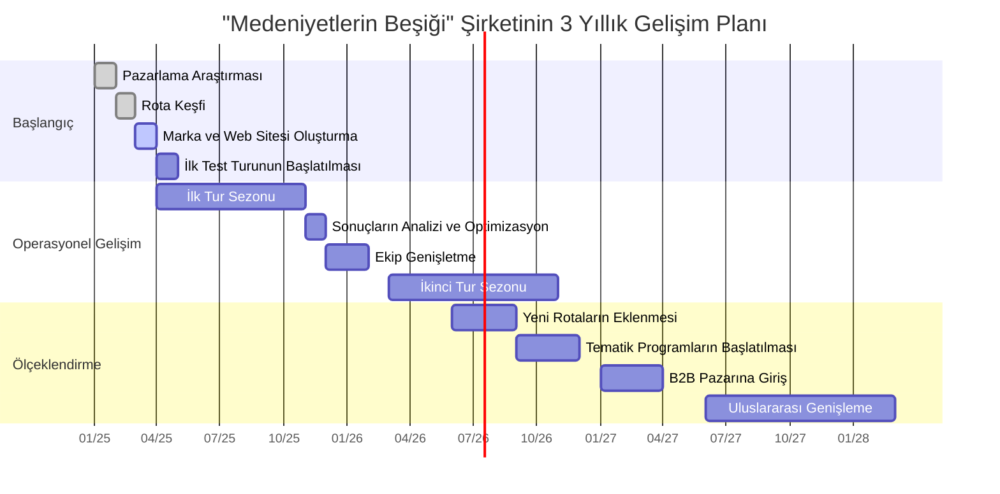
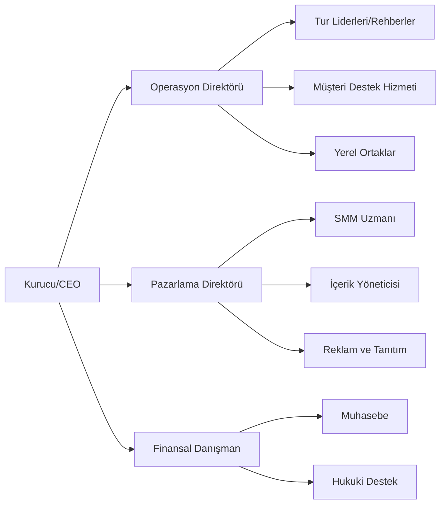
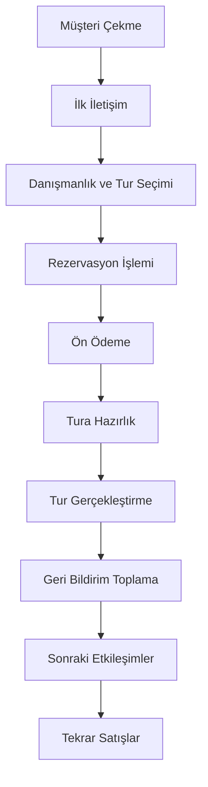

### Projenin Temel Gelişim Aşamaları Diyagramı

### İlk Yıl İçin Detaylı Plan (Üç Aylık Dönemler Halinde)

**Q1 (Ocak-Mart 2025):**

- Pazar ve hedef kitle araştırmasının yapılması
- Detayları incelemek için rota keşif gezisi
- Marka konsepti ve görsel kimliğin oluşturulması
- Şirket web sitesinin geliştirilmesi ve başlatılması
- Tüzel kişiliğin tescili ve gerekli belgelerin düzenlenmesi
- Sosyal medyada varlık oluşturmaya başlama

**Q2 (Nisan-Haziran 2025):**

- Ortaklar ve bloggerlar için test turunun düzenlenmesi
- İlk ticari turların başlatılması (Nisan-Mayıs)
- Hedefli reklamlar aracılığıyla ilk grupların aktif olarak toplanması
- Yerel hizmet sağlayıcılarla ortaklık ilişkilerinin kurulması
- İlk yorumların toplanması ve analizi, programın düzeltilmesi
- Pazarlama için içerik tabanı oluşturma (fotoğraf, video, yorumlar)

**Q3 (Temmuz-Eylül 2025):**

- Yüksek sezon turlarının gerçekleştirilmesi (Eylül)
- Pazarlama faaliyetlerinin genişletilmesi, influencer'ların dahil edilmesi
- Programın yeni unsurlarının test edilmesi
- Tekrar eden müşteriler için sadakat programının geliştirilmesi
- Edinilen deneyime dayanarak sonbahar turlarının planlanması
- Ek tur formatları üzerinde çalışmaya başlama

**Q4 (Ekim-Aralık 2025):**

- İlk turizm sezonunun tamamlanması (Ekim-Kasım)
- İlk yıl sonuçlarının kapsamlı analizi
- Operasyonel süreçlerin optimize edilmesi
- Bir sonraki yıl için tur programının planlanması
- Erken rezervasyon için pazarlama kampanyasının başlatılması
- İkinci yıl için gelişim stratejisinin oluşturulması

### Şirket Organizasyon Yapısı

**Diyagrama Not:** Başlangıç aşamasında, birçok fonksiyon az sayıda çalışan tarafından birleştirilecek ve şirket büyüdükçe roller kademeli olarak ayrılacaktır.

### Satış Süreci Yapısı

**Her Aşamadaki Temel Metrikler:**

- Potansiyel müşterilerden rezervasyona dönüşüm oranı
- Ön ödemeyle onaylanan rezervasyon yüzdesi
- Müşteri memnuniyeti (5 üzerinden derecelendirme)
- Tekrar rezervasyon yüzdesi
- NPS (Net Tavsiye Skoru)