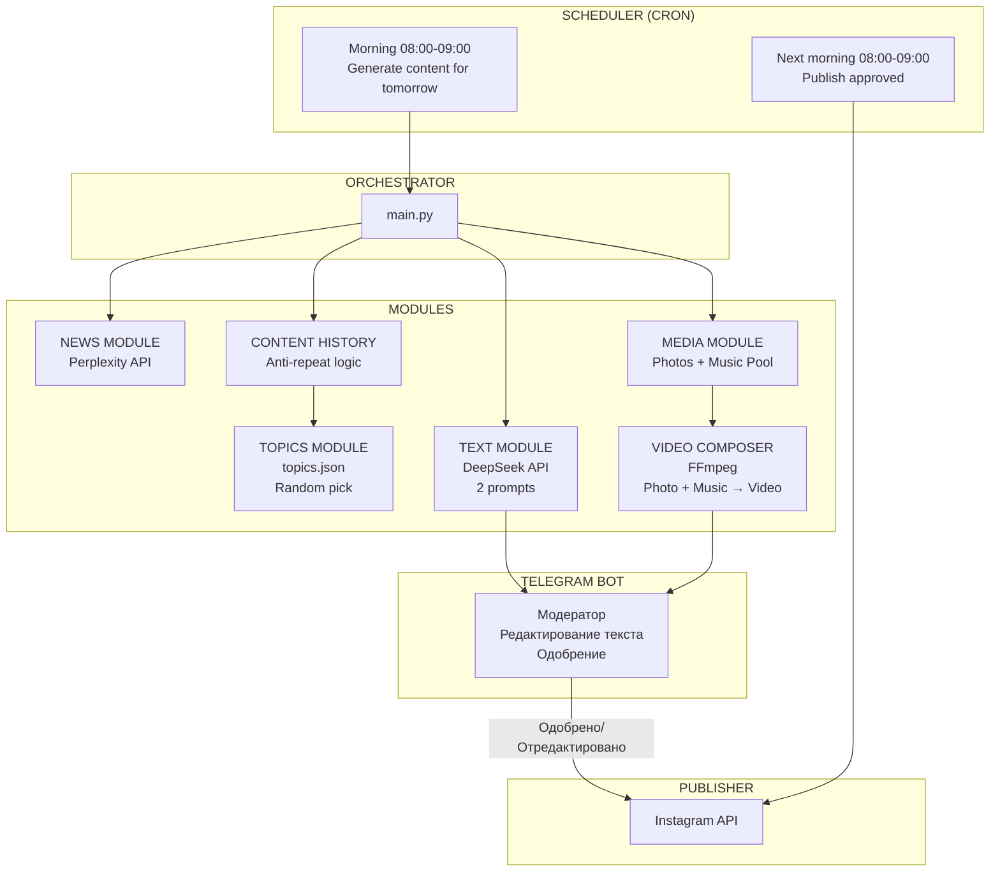
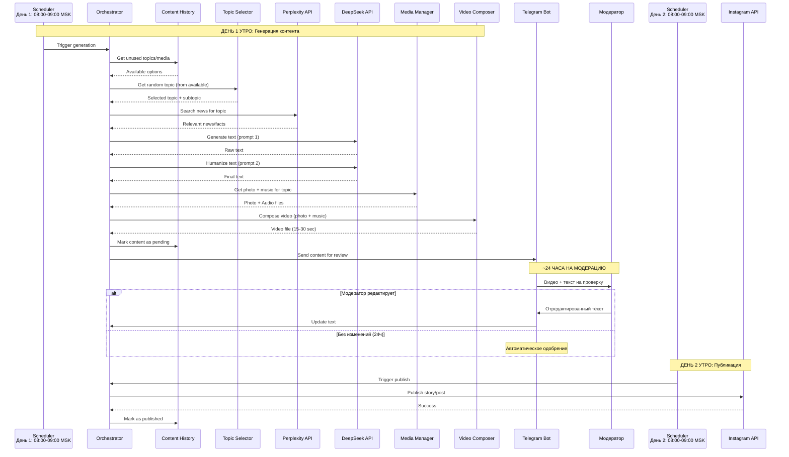
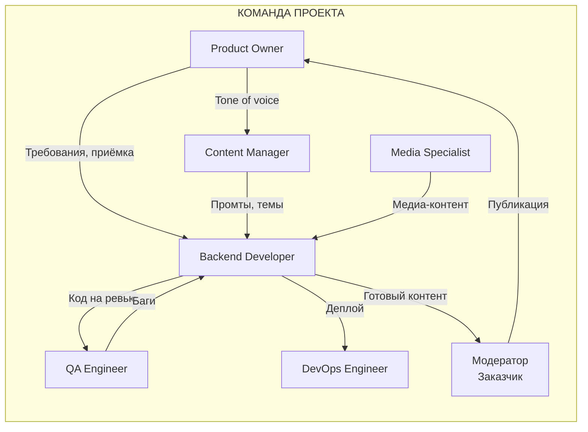
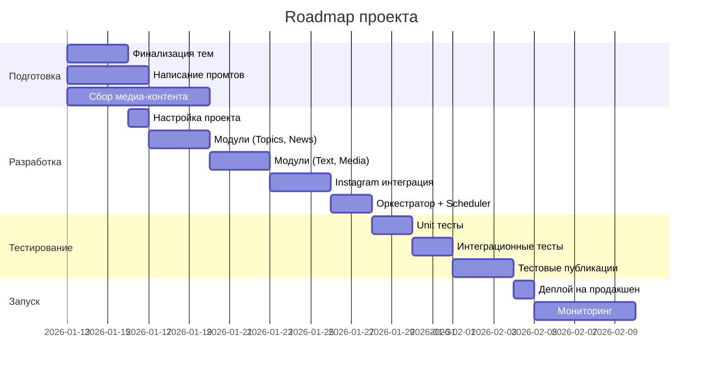

# Instagram Automation System: tours.batumi

## 1. Обзор проекта

**Цель:** Автоматизация создания и публикации контента для Instagram-канала tours.batumi

**Ключевые функции:**
- Ежедневные stories с фото и грузинской музыкой
- 3 развёрнутых поста в неделю
- Автоматический подбор тем, генерация текста, подбор медиа

---

## 2. Архитектура системы



### Детализированная схема потока данных



---

## 3. Структура директорий

```
tours-batumi-bot/
├── .env                      # API keys (в .gitignore!)
├── .env.example              # Пример .env для разработчиков
├── config/
│   ├── settings.py           # Загрузка конфигурации из .env
│   └── topics.json           # Расширенный список тем
├── prompts/
│   ├── story_generator.txt   # Промт генерации текста story
│   ├── story_humanizer.txt   # Промт "очеловечивания" story
│   ├── post_generator.txt    # Промт генерации поста
│   └── post_humanizer.txt    # Промт "очеловечивания" поста
├── media/
│   ├── photos/               # Пул фотографий (по категориям)
│   │   ├── mountains/
│   │   ├── architecture/
│   │   ├── food/
│   │   └── ...
│   └── music/                # Пул грузинских мелодий
│       ├── traditional/
│       └── modern/
├── data/
│   └── content_history.json  # История публикаций (anti-repeat)
├── src/
│   ├── modules/
│   │   ├── topic_selector.py
│   │   ├── news_fetcher.py   # Perplexity API
│   │   ├── text_generator.py # DeepSeek API
│   │   ├── media_manager.py  # Фото + музыка
│   │   ├── video_composer.py # FFmpeg: photo + music → video
│   │   ├── content_history.py # Учёт использованного контента
│   │   ├── telegram_bot.py   # Интерфейс модерации
│   │   └── publisher.py      # Instagram API
│   ├── orchestrator.py       # Главный координатор
│   └── scheduler.py          # Планировщик задач
├── logs/
├── tests/
├── requirements.txt
└── README.md
```

---

## 4. Расширенный список тем (topics.json)

```json
{
  "categories": [
    {
      "id": "mountain_adjara",
      "name": "Горная Аджария",
      "subtopics": [
        "Хуло и канатная дорога",
        "Горнолыжный курорт Годердзи",
        "Село Хихани и водопады",
        "Зелёное озеро (Мтирала)",
        "Национальный парк Мтирала",
        "Крепость Хихани",
        "Традиционные аджарские сёла",
        "Горные серпантины Аджарии"
      ]
    },
    {
      "id": "weather",
      "name": "Погода в Батуми",
      "subtopics": [
        "Субтропический климат Батуми",
        "Лучшее время для посещения",
        "Сезон дождей и как к нему готовиться",
        "Зима в Батуми",
        "Весеннее цветение",
        "Летний пляжный сезон",
        "Осенний бархатный сезон"
      ]
    },
    {
      "id": "currency",
      "name": "Валюта и обмен",
      "subtopics": [
        "Грузинский лари: история и курс",
        "Лучшие обменники в Батуми",
        "Банкоматы и комиссии",
        "Оплата картой vs наличные",
        "Криптовалюта в Грузии",
        "Переводы и банковские карты для туристов"
      ]
    },
    {
      "id": "cuisine",
      "name": "Грузинская кухня",
      "subtopics": [
        "Хачапури по-аджарски: рецепт",
        "Хинкали: как правильно есть",
        "Аджарские блюда: борано, синори",
        "Грузинские соусы: ткемали, сацебели",
        "Чурчхела и пеламуши",
        "Грузинское вино и чача",
        "Лучшие рестораны Батуми",
        "Уличная еда в Батуми",
        "Рынок Парехи",
        "Вегетарианская грузинская кухня"
      ]
    },
    {
      "id": "nature",
      "name": "Природа",
      "subtopics": [
        "Батумский ботанический сад",
        "Водопад Махунцети",
        "Каньон Мартвили (однодневная поездка)",
        "Река Чорохи",
        "Пляжи Батуми и окрестностей",
        "Национальный парк Мтирала",
        "Озеро Рица (поездка)",
        "Горные походы"
      ]
    },
    {
      "id": "roads",
      "name": "Дороги",
      "subtopics": [
        "Дорога Батуми-Тбилиси",
        "Дорога в горную Аджарию",
        "Аренда авто в Батуми",
        "Состояние дорог",
        "Заправки и топливо",
        "ПДД в Грузии",
        "Парковки в Батуми"
      ]
    },
    {
      "id": "safety",
      "name": "Безопасность",
      "subtopics": [
        "Уровень преступности в Батуми",
        "Безопасность для туристов",
        "Ночная жизнь и безопасность",
        "Медицинская помощь",
        "Экстренные номера",
        "Безопасность на пляже",
        "Безопасность в горах"
      ]
    },
    {
      "id": "architecture",
      "name": "Архитектура Батуми",
      "subtopics": [
        "Башня Алфавита",
        "Статуя Али и Нино",
        "Площадь Пьяцца",
        "Астрономические часы",
        "Современные небоскрёбы",
        "Старый город",
        "Батумский бульвар",
        "Мечеть Орта Джаме"
      ]
    },
    {
      "id": "history",
      "name": "История Батуми",
      "subtopics": [
        "Древняя Колхида",
        "Османский период",
        "Российская империя и нефтяной бум",
        "Советский период",
        "Независимость Грузии",
        "Современное развитие"
      ]
    },
    {
      "id": "transport",
      "name": "Транспорт",
      "subtopics": [
        "Аэропорт Батуми",
        "Такси и Bolt/Yandex",
        "Маршрутки",
        "Автобусы",
        "Железнодорожный вокзал",
        "Паром в Турцию",
        "Трансфер из аэропорта"
      ]
    },
    {
      "id": "rentals",
      "name": "Аренда транспорта",
      "subtopics": [
        "Электросамокаты Scroll",
        "Аренда велосипедов",
        "Электрокары для прогулок",
        "Аренда скутеров",
        "Прокат автомобилей"
      ]
    },
    {
      "id": "traditions",
      "name": "Традиции",
      "subtopics": [
        "Грузинское гостеприимство",
        "Тост и тамада",
        "Грузинские праздники",
        "Религия и православие",
        "Аджарская культура",
        "Традиционная одежда",
        "Грузинские танцы",
        "Полифоническое пение"
      ]
    }
  ]
}
```

---

## 5. Рекомендации по ключевым решениям

### 5.1. Фотографии: ПОИСК > ГЕНЕРАЦИЯ

**Рекомендация: Гибридный подход с приоритетом на реальные фото**

| Подход | Плюсы | Минусы |
|--------|-------|--------|
| Собственный пул фото | Аутентичность, контроль качества | Требует первоначального сбора |
| Unsplash/Pexels API | Бесплатно, качественно | Ограниченный выбор по Батуми |
| AI-генерация (Nanobanana) | Безлимитно | Может выглядеть "пластиково" для travel-контента |

**Итоговое решение:**
1. **Основной источник:** Собственный курированный пул (500+ фото)
2. **Резерв:** Unsplash API для общих тем (горы, еда, природа)
3. **AI-генерация:** Только для абстрактных тем или при исчерпании пула

### 5.2. Музыка: ПУЛ > ГЕНЕРАЦИЯ

**Рекомендация: Предварительно собранный пул**

**Обоснование:**
- Аутентичные грузинские мелодии невозможно качественно сгенерировать
- AI-музыка не передаст характер грузинской полифонии
- Лицензионные вопросы проще решить один раз

**Итоговое решение:**
- Пул из **30-50 треков** (по 15-30 секунд каждый)
- Категории: традиционные, современные, инструментальные
- Источники: royalty-free грузинская музыка, лицензированные треки

### 5.3. Stories: ВИДЕО > ФОТО

**Причина:** Instagram Graph API не поддерживает добавление музыки к фото-stories напрямую.

**Итоговое решение:**
- Создавать **видео** из статичного фото + музыки (FFmpeg)
- Длительность: 15-30 секунд (длина музыкального трека)
- Текст публикуется как caption к видео

### 5.4. Модерация: TELEGRAM BOT

**Функционал Telegram-бота:**
- Получение сгенерированного контента (видео + текст)
- Возможность отредактировать текст прямо в боте
- Кнопки: "Одобрить" / "Отредактировать" / "Отклонить"
- Автоматическое одобрение через 24 часа без действий

**Workflow:**
1. **День 1, утро (08:00-09:00):** система генерирует контент на завтра
2. Контент отправляется модератору в Telegram
3. **~24 часа:** модератор редактирует или одобряет
4. **День 2, утро (08:00-09:00):** публикуется одобренный контент

### 5.5. Защита от повторов: CONTENT HISTORY

**Механизм:**
- `data/content_history.json` хранит историю всех публикаций
- Подтема не повторяется в течение **7 дней**
- Отслеживание использованных фото и музыки
- Ротация медиа-контента для разнообразия

**Структура content_history.json:**
```json
{
  "publications": [
    {
      "date": "2026-01-12",
      "type": "story",
      "category": "cuisine",
      "subtopic": "Хачапури по-аджарски: рецепт",
      "photo": "photos/food/khachapuri_001.jpg",
      "music": "music/traditional/saqartvelo.mp3",
      "text": "..."
    }
  ],
  "last_used": {
    "subtopics": {"Хачапури по-аджарски: рецепт": "2026-01-12"},
    "photos": {"photos/food/khachapuri_001.jpg": "2026-01-12"},
    "music": {"music/traditional/saqartvelo.mp3": "2026-01-12"}
  }
}
```

---

## 6. Распределение ролей и задач



### 6.1. Product Owner
**Ответственный:** [Имя]

| Задача | Описание | Приоритет |
|--------|----------|-----------|
| Финализация требований | Согласовать частоту постов, tone of voice | P0 |
| Приёмка контента | Утверждение списка тем и промтов | P0 |
| Метрики успеха | Определить KPI (охват, вовлечённость) | P1 |

---

### 6.2. Backend Developer
**Ответственный:** [Имя]

| Задача | Описание | Оценка |
|--------|----------|--------|
| Настройка проекта | Структура, окружение, CI/CD | — |
| Модуль тем | Парсинг topics.json, рандомный выбор | — |
| Интеграция Perplexity | Поиск новостей по теме | — |
| Интеграция DeepSeek | Генерация + humanization | — |
| Модуль медиа | Выбор фото/музыки из пула | — |
| **Video Composer** | FFmpeg: photo + music → video | — |
| **Content History** | Anti-repeat логика, ротация контента | — |
| **Telegram Bot** | Интерфейс модерации, редактирование | — |
| Интеграция Instagram | Публикация stories и постов | — |
| Планировщик | Cron-задачи (вечер + утро) | — |
| Оркестратор | Связывание всех модулей | — |
| Тестирование | Unit + integration tests | — |

---

### 6.3. Content Manager
**Ответственный:** [Имя]

| Задача | Описание | Приоритет |
|--------|----------|-----------|
| Расширение тем | Добавить подтемы, проверить актуальность | P0 |
| Написание промтов | Создать все 4 промта (story/post × gen/human) | P0 |
| Тестирование промтов | Проверить качество генерации | P0 |
| Редакционная политика | Tone of voice, запрещённые темы | P1 |
| Хештеги | Подготовить списки хештегов по категориям | P1 |

---

### 6.4. Media Specialist / Designer
**Ответственный:** [Имя]

| Задача | Описание | Приоритет |
|--------|----------|-----------|
| Сбор фотографий | 500+ фото по категориям | P0 |
| Обработка фото | Ресайз, цветокоррекция, формат для Stories | P0 |
| Сбор музыки | 30-50 треков, нарезка 15-30 сек | P0 |
| Проверка лицензий | Убедиться в royalty-free статусе | P0 |
| Шаблоны Stories | Если нужны брендированные элементы | P2 |

---

### 6.5. DevOps Engineer
**Ответственный:** [Имя]

| Задача | Описание | Приоритет |
|--------|----------|-----------|
| Сервер | Настройка VPS/облака для бота | P0 |
| Деплой | Docker-контейнер, автозапуск | P0 |
| Мониторинг | Алерты при ошибках публикации | P1 |
| Бэкапы | Резервирование медиа и логов | P2 |

---

### 6.6. QA Engineer
**Ответственный:** [Имя]

| Задача | Описание | Приоритет |
|--------|----------|-----------|
| Тест-кейсы | Покрытие всех модулей | P0 |
| Тестовый аккаунт | Проверка публикаций в тестовом Instagram | P0 |
| Проверка контента | Качество текста, соответствие теме | P1 |
| Нагрузочное тестирование | Работа при ошибках API | P1 |

---

## 7. API и сервисы

| Сервис | Назначение | Стоимость |
|--------|------------|-----------|
| Perplexity API | Поиск актуальных новостей | ~$20/мес |
| DeepSeek API | Генерация текста | ~$5-10/мес |
| Instagram Graph API | Публикация контента | Бесплатно (нужен Business аккаунт) |
| Unsplash API | Резервный источник фото | Бесплатно |
| **Telegram Bot API** | Интерфейс модерации | Бесплатно |
| **FFmpeg** | Создание видео из фото + музыка | Бесплатно (open source) |

---

## 8. Этапы реализации



### Чеклист по этапам

#### Этап 1: Подготовка
- [ ] Финализация списка тем
- [ ] Написание и тестирование промтов
- [ ] Сбор медиа-контента (фото + музыка)
- [ ] Настройка окружения разработки

#### Этап 2: Разработка
- [ ] Разработка всех модулей
- [ ] Интеграция с API
- [ ] Unit-тесты

#### Этап 3: Тестирование
- [ ] Интеграционное тестирование
- [ ] Тестовые публикации
- [ ] Доработка промтов по результатам

#### Этап 4: Запуск
- [ ] Деплой на продакшен
- [ ] Мониторинг первых публикаций
- [ ] Корректировки по фидбеку

---

## 9. Риски и митигация

| Риск | Вероятность | Влияние | Митигация |
|------|-------------|---------|-----------|
| Instagram заблокирует бота | Средняя | Высокое | Использовать официальный API, соблюдать лимиты |
| Некачественный текст от AI | Средняя | Низкое | Обязательная модерация перед публикацией |
| API Perplexity/DeepSeek недоступен | Низкая | Среднее | Fallback на альтернативные API |
| Заканчиваются фото в пуле | Низкая | Низкое | Регулярное пополнение, Unsplash fallback |

---

## 10. Метрики успеха

| Метрика | Цель (3 месяца) |
|---------|-----------------|
| Количество подписчиков | +1000 |
| Охват Stories | 500+ просмотров |
| Engagement Rate постов | >5% |
| Сбои публикации | <2% |

---

## 11. Принятые решения

| Вопрос | Решение |
|--------|---------|
| **Модерация** | Telegram-бот: редактирование текста + одобрение |
| **Время генерации** | 08:00-09:00 MSK (утром, контент на завтра) |
| **Время публикации** | 08:00-09:00 MSK следующего дня |
| **Окно модерации** | ~24 часа между генерацией и публикацией |
| **Fallback при отсутствии модерации** | Автопубликация через 24 часа без изменений |
| **Формат Stories** | Видео (фото + музыка через FFmpeg), текст как caption |
| **Защита от повторов** | content_history.json, подтема не повторяется 7 дней |
| **Языки** | Только русский. Английский — отдельный канал при необходимости |
| **Ответы на комментарии** | Вручную силами заказчика |
| **Метаданные медиа** | Заказчик привязывает фото к категориям |
| **Reels (видео)** | Phase 2, video_composer модуль уже заложен |

---

## 12. Планы на будущее (Phase 2)

После успешного запуска основного функционала:
- [ ] Добавление Reels / видео-контента
- [ ] Английская версия канала (при запросе заказчика)
- [ ] Аналитика и автоматические отчёты
- [ ] A/B тестирование времени публикации

---

*Документ создан: 2026-01-12*
*Версия: 1.3*
*Обновлено: 2026-01-12 — workflow: генерация утром → 24ч модерация → публикация на следующее утро*
